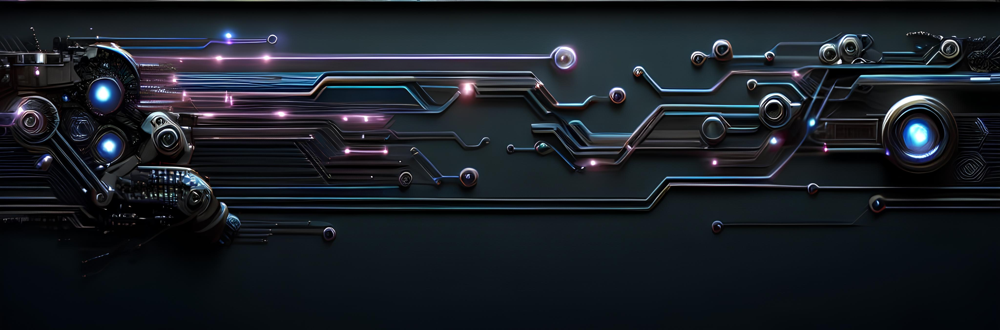

  

###

###

###

<h1 align="center">Hi 👋, I'm Rami Ghanem</h1>

###

<h3 align="left">👩‍💻  About Me</h3>

###

As an Artificial Intelligence Engineer at Connected Motion, I specialize in enhancing computer vision models through synthetic image generation. Utilizing advanced 3D software like Blender and Nvidia Omniverse, I create highly realistic images with annotations, eliminating the need for human intervention in the labeling process. This innovative approach significantly accelerates the training and accuracy of AI models.

Currently, I'm expanding my expertise by learning ROS2, aiming to apply my knowledge in developing next-gen robotic solutions. My passion lies in pushing the boundaries of AI and robotics, and I'm committed to contributing to groundbreaking advancements in the field.

###

<h3 align="left">🛠 Language and tools</h3>

###

<table width="320px">
    <tbody>
        <tr valign="top">
            <td width="80px" align="center">
            <strong>Python</strong> 
            
            </td>
            <td width="80px" align="center">
            <strong>c++ </strong> 
            
            </td>
            </td>
             <td width="80px" align="center">
            <strong>T-SQL</strong> 
            
            </td>
             <td width="80px" align="center">
            <strong>linux</strong> 
            
            </td>
            <td width="80px" align="center">
            <strong>Git</strong> 
            
            </td>
            <td width="80px" align="center">
            <strong>GitHub</strong> 
            
            </td>
            <td width="80px" align="center">
            <strong>Markdown</strong> 
            
            </td>
        </tr>
        <tr valign="top">
            <td width="80px" align="center">
            <strong>docker</strong> 
            
            </td>
             <td width="80px" align="center">
            <strong>VSCode</strong> 
            
            </td>
             <td width="80px" align="center">
            <strong>Anaconda</strong> 
            
            </td>
             <td width="80px" align="center">
            <strong>Jupyter</strong> 
            
            </td>
            <td width="80px" align="center">
            <!-- <strong>Java</strong> 
             -->
            </td>
            <td width="80px" align="center">
            <!-- <strong>HTML</strong> 
             -->
            </td>
            <td width="80px" align="center">
            <!-- <strong>CSS</strong> 
             -->
            </td>
        </tr>
        <tr valign="top">
            <td width="80px" align="center">
            <strong>TensorFlow</strong> 
            
            </td>
             <td width="80px" align="center">
            <strong>Keras</strong> 
            
            </td>
             <td width="80px" align="center">
            <strong>scikitLearn</strong> 
            
            </td>
             <td width="80px" align="center">
            <strong>Pandas</strong> 
            
            </td>
            <td width="80px" align="center">
            <strong>NumPy</strong> 
            
            </td>
            <td width="80px" align="center">
            <strong>OpenCV</strong> 
            
            </td>
            <td width="80px" align="center">
            <!-- <strong>CSS</strong> 
             -->
            </td>
        </tr>
         <tr valign="top">
          </td>
            <td width="80px" align="center">
            <strong>omniverse</strong> 
            
            </td>
            <td width="80px" align="center">
            <strong>Blender</strong> 
            
            </td>
            <td width="80px" align="center">
            <strong>ROS2</strong> 
            
            </td>
             <td width="80px" align="center">
            <!-- <strong>NodeJs</strong> 
             -->
            </td>
             <td width="80px" align="center">
            <!-- <strong>ReactJs</strong> 
             -->
            </td>
             <td width="80px" align="center">
            <!-- <strong>Python</strong> 
             -->
            </td>
            <td width="80px" align="center">
            <!-- <strong>Java</strong> 
             -->
        </tr>
    </tbody>
</table>

###

<h3 align="left">🔥   My Stats :</h3>

###

###